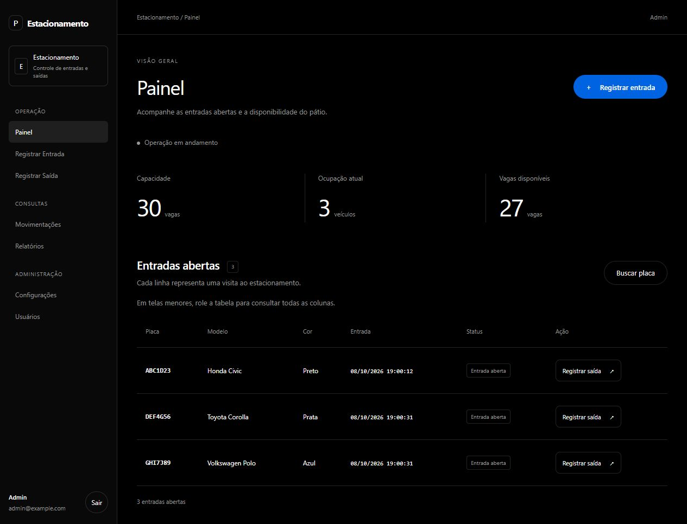
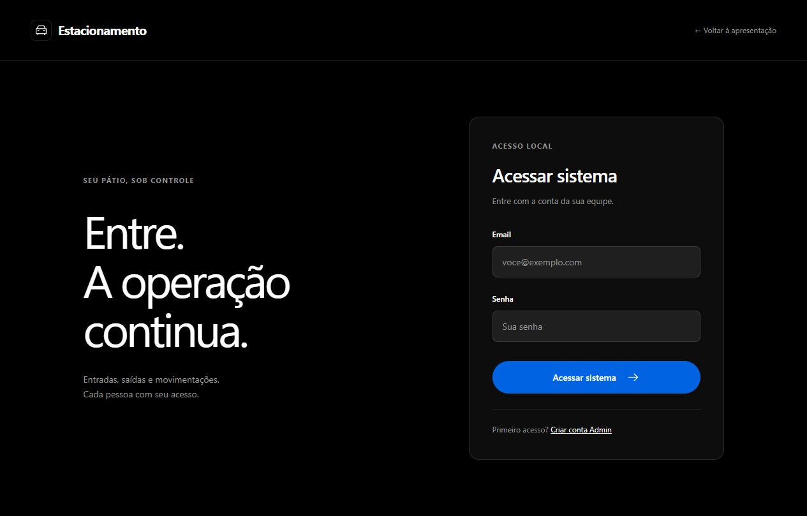
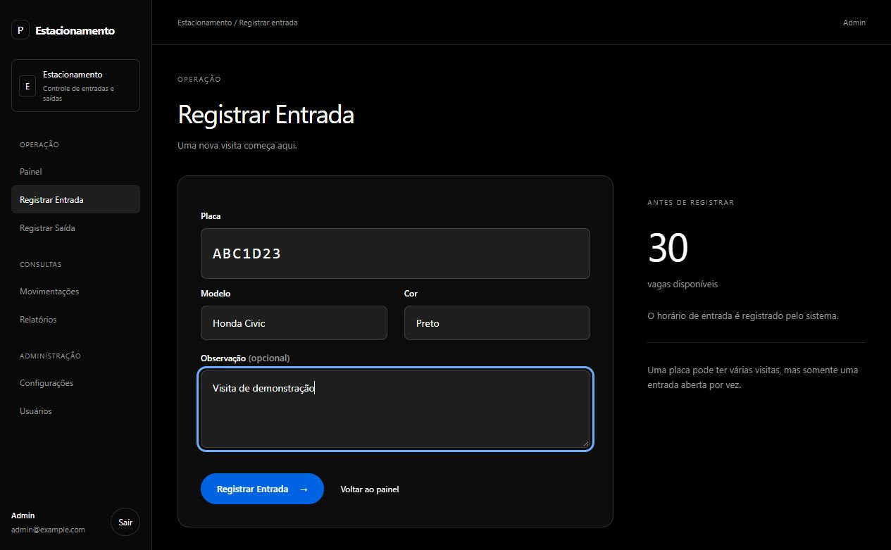
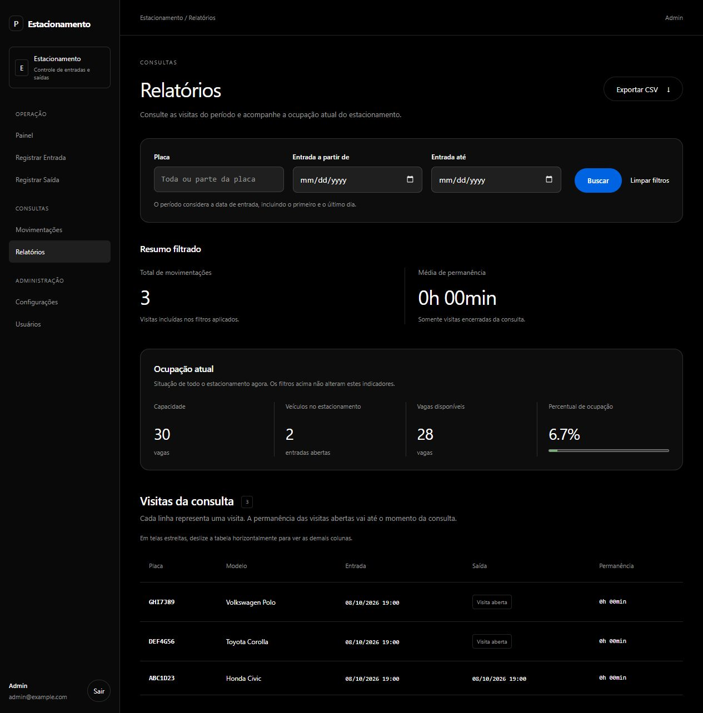
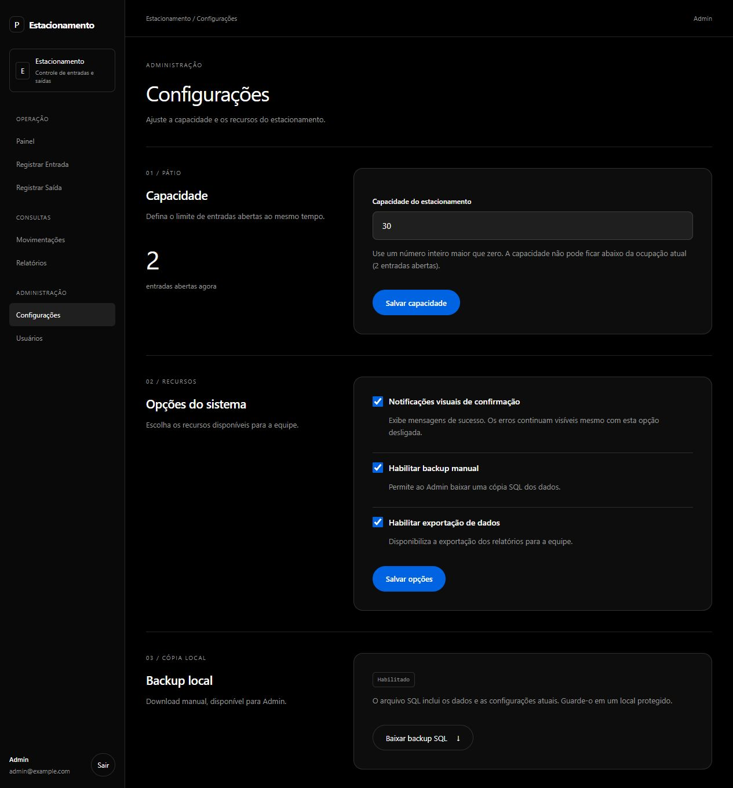
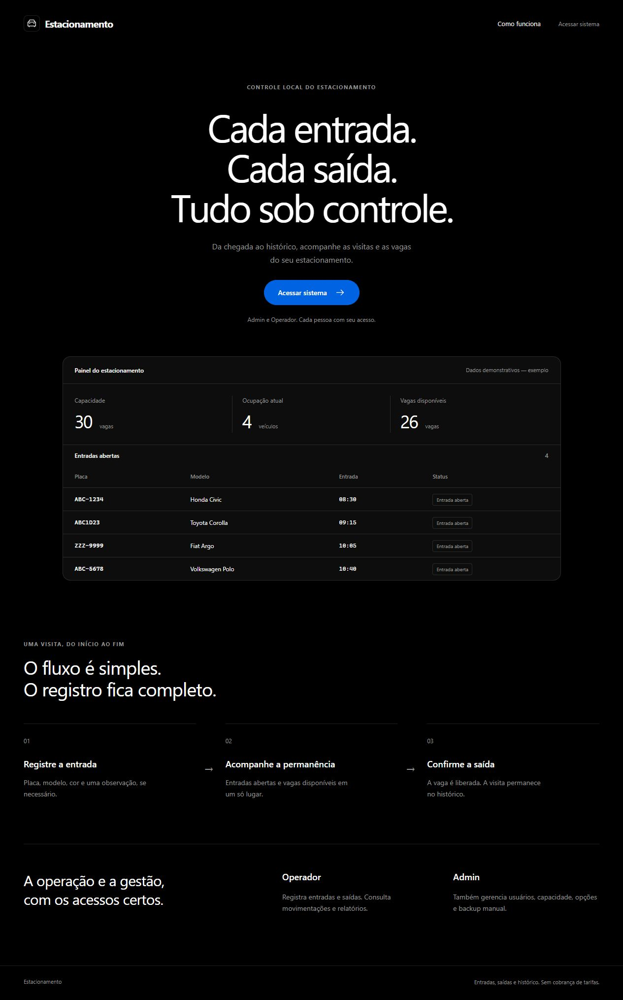

  <h1>🅿️ Estacionamento Spring</h1>

  
<strong>Cada entrada. Cada saída. Tudo sob controle.</strong>

  
Controle de vagas, visitas e histórico em uma aplicação web simples de operar.

  

    
    
    
    
  

  

    
  

  
Demonstração hospedada no Render. O primeiro acesso pode demorar enquanto o serviço inicia; os dados são temporários.

  

    <a href="#sobre">Sobre</a> ·
    <a href="#funcionalidades">Funcionalidades</a> ·
    <a href="#interface">Interface</a> ·
    <a href="#tecnologias">Tecnologias</a>
  

---

## 🚗 Sobre o projeto

O **Estacionamento Spring** organiza o dia a dia de um estacionamento: da chegada do veículo à consulta de suas visitas anteriores. O painel reúne entradas abertas, ocupação atual e vagas disponíveis, enquanto o histórico preserva os horários de entrada e saída.

A interface é responsiva e oferece dois perfis de acesso: o **Operador** registra entradas e saídas e consulta os dados; o **Admin** também gerencia usuários, capacidade e configurações. O foco do projeto é o controle das visitas, sem cobrança de tarifas.

## ✨ Funcionalidades

| Recurso | O que oferece |
| --- | --- |
| **Painel** | Capacidade, ocupação, vagas disponíveis e entradas abertas. |
| **Entradas e saídas** | Registro dos veículos e encerramento das visitas com histórico preservado. |
| **Movimentações** | Consulta de visitas por placa e período de entrada. |
| **Relatórios** | Total de visitas, média de permanência e exportação em CSV. |
| **Usuários** | Contas com papéis de Admin e Operador e controle de acesso. |
| **Configurações** | Capacidade do pátio, notificações, exportação e backup SQL manual. |

## 🖥️ Conheça a interface

Capturas da aplicação com dados fictícios de demonstração.

<strong>Ver mais telas</strong>

 

<table>
  <tr>
    <td width="50%" align="center">
      <strong>Login</strong>  
      
    </td>
    <td width="50%" align="center">
      <strong>Registro de entrada</strong>  
      
    </td>
  </tr>
  <tr>
    <td width="50%" align="center">
      <strong>Relatórios</strong>  
      
    </td>
    <td width="50%" align="center">
      <strong>Configurações</strong>  
      
    </td>
  </tr>
</table>

<strong>Ver página de apresentação</strong>

## 🛠️ Tecnologias

Desenvolvido com **Java 25** e **Spring Boot 4.1.0**, usando **Spring MVC** e **Thymeleaf** para as páginas, **Spring Data JPA / Hibernate** para persistência e **H2** como banco de dados. A autenticação e as permissões são gerenciadas pelo **Spring Security**.

---

  Estacionamento Spring · Da chegada ao histórico.

